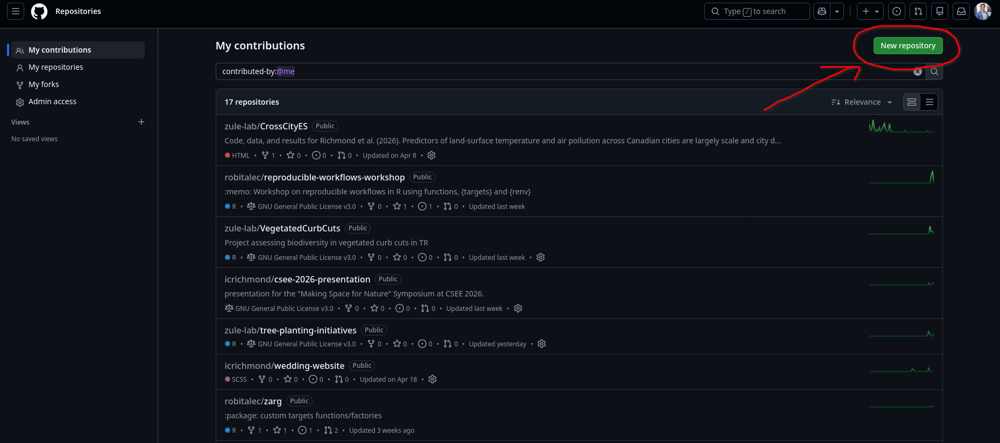
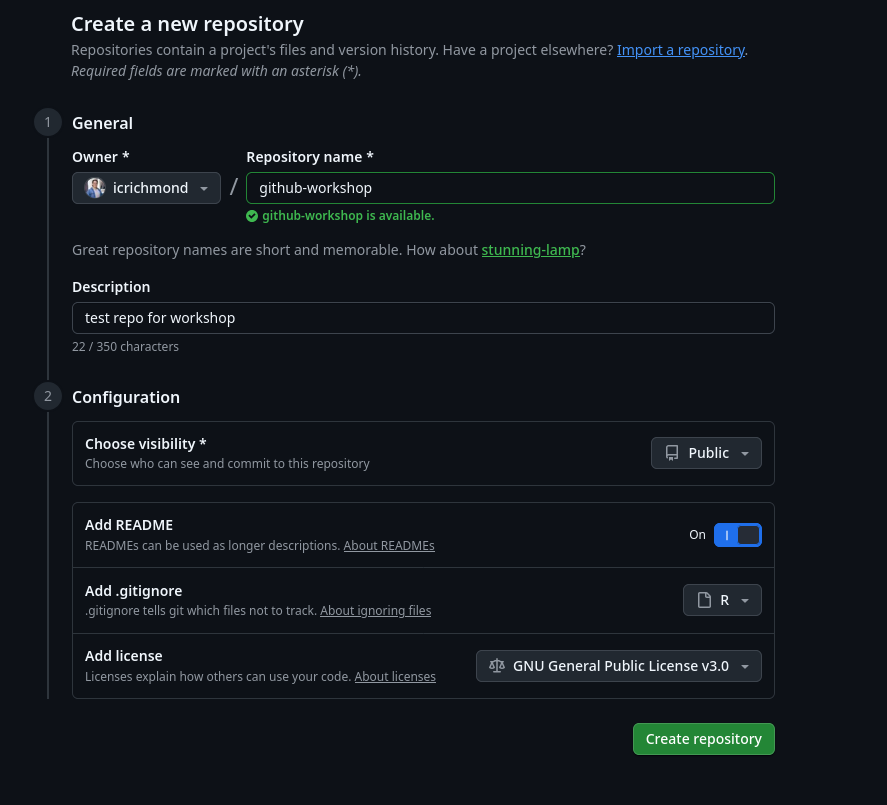
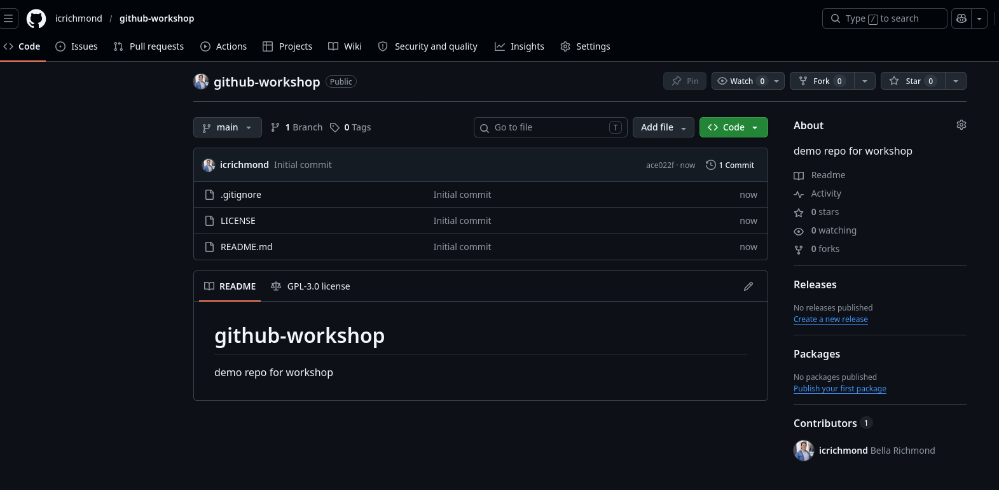
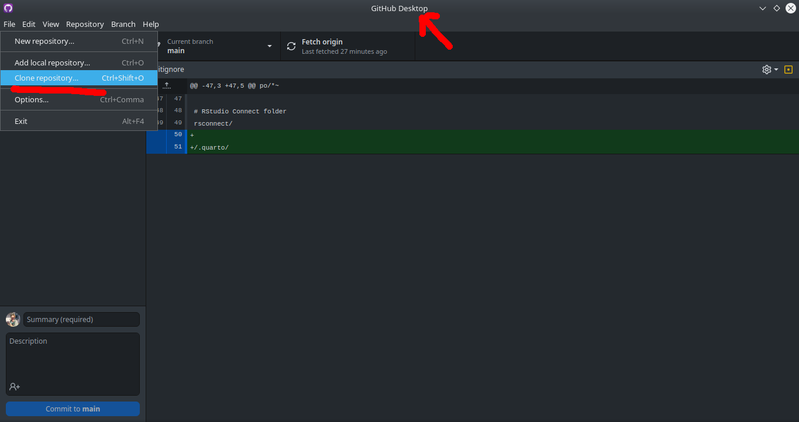
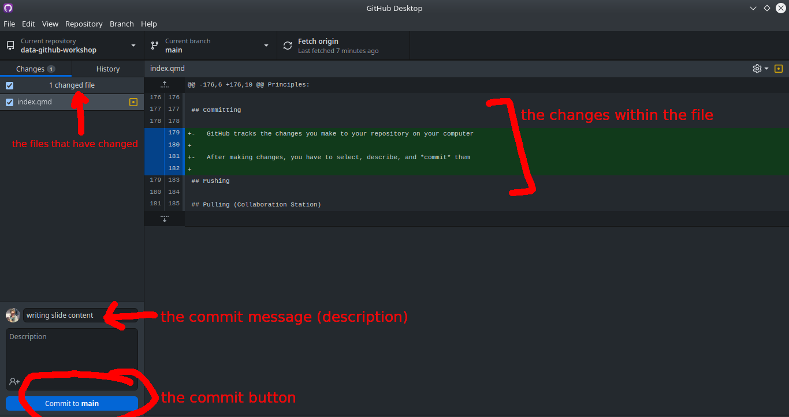
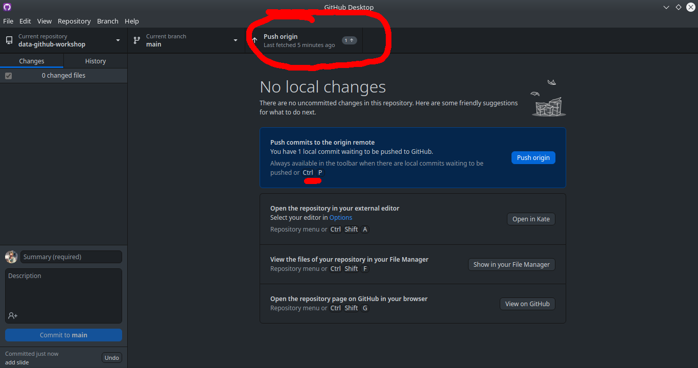

# Part I: Prep Work

## Learning Goals

My goal for this workshop is to give everyone the tools to:

::: incremental
-   Confidently start a project in R
-   Manage files in a way that is reproducible and easy to understand
-   Allow people to document history/progress on their projects
-   Know one approach to publicly archiving projects
:::

## GitHub Caveats

-   Microsoft is a deeply evil company that profits from the war machine and the destruction of our planet
-   GitHub is a Microsoft company
-   There aren't currently a lot of alternatives, but there will be eventually and you can check out [this list](https://itsfoss.com/github-alternatives/) if you're interested

## Privacy Caveats!!!

-   This lab has many examples of data that should not be uploaded to the internet, that does not mean that we can not use GitHub/Zenodo/reproducible science tools
-   We need to be extremely mindful, make sure our code is anonymized
-   Upload fake example data so that users can understand how our code works, with clear metadata that explains that the real data is unavailable

## Software Installation

-   **CHECK-IN: does everyone have everything working/installed?**

## Transparent Workflows

-   Ensuring that your workflow is transparent is important for:

    -   Past/Current/Future You

    -   WWALK Lab

    -   Collaborators

    -   Other grad students

    -   Scientific Community

    -   **PUBLIC**

# Part II: R & RStudio

## Project Management in R

Good file structure is important because it [^1]

[^1]: [Software Carpentry Project Management](https://swcarpentry.github.io/r-novice-gapminder/02-project-intro/index.html)

::: incremental
-   Ensures the integrity of your data
-   Makes it easier to share your code with people
-   Makes it easier to upload your code/data with manuscript submission
-   Makes it easier to come back after a break
:::

## File Management for R

Best practices include (but are not limited to) [^2]

[^2]: [Software Carpentry Project Management](https://swcarpentry.github.io/r-novice-gapminder/02-project-intro/index.html)

::: incremental
-   Use an R Project file so that your project is easily shareable
-   Always treat raw data as read-only
-   Store cleaned data in a separate folder (or distinguish clearly)
-   Treat output as disposable - you should always be able to re-generate with script
-   Have separate function and figure scripts
:::

## Cleaning Data in R

There are some tasks that do not need to be "as reproducible" (e.g., fixing typos) - these can be done in [OpenRefine](https://openrefine.org/).

In general if you are:

-   Combining data sources

-   Making decisions about the data itself (e.g., removing or adding data)

-   Performing calculations

-   Renaming things

Do this in R (you will be grateful later!)

## Basic File Structure

```         
project
└───raw-data/
└───output/
└───R/
└───graphics/
└───README.md
```

## Exercise: make a project

-   Let's set up a new project using RStudio Projects

-   Add raw-data, output, R, and graphics folders

-   (Bonus: I recommend you have a folder on your computer dedicated to all R projects)

# Part III: GitHub

## GitHub & Version Control

{fig-align="center"}

## GitHub & Version Control

::: incremental
-   GitHub is a website-software that documents your progress on a project and allows you to do *version control*

    -   aka it takes snapshots of your progress across time so nothing gets lost

-   If you save rough drafts of your writing as you go along - that is version control

-   Really useful for when you want to go back/change your mind/re-run a test/etc.

-   Facilitates lower mental load + reproducible science + collaboration/sharing
:::

## Project Workflow with Git

{fig-align="center"}

## Project Workflow with Git + Others

{fig-align="center"}

## The Basics of GitHub

-   5 basic jargon terms you need to know to use GitHub:
    -   Repository/repo: your project
    -   Clone: make a local copy of your project
    -   Commit: describe and commit to any changes you've made
    -   Push: send your changes to your online repo
    -   Pull: incorporate any changes to your local repo
    -   (BONUS branch: a side project)
-   *We will do all these things today!*

## Exercise: make a repo!

[github.com/repos](www.github.com/repos)

{fig-align="center"}

## Exercise: make a repo!

{fig-align="center"}

## Exercise: make a repo!

[github.com/icrichmond/github-workshop](github.com/icrichmond/github-workshop) {fig-align="center"}

## Cloning (Download An Existing Directory)

<div>



</div>

## Committing

-   GitHub tracks the changes you make to your repository on your computer

-   After making changes, you have to select, describe, and *commit* them

## Committing

{fig-align="center"}

## Pushing

After committing, you push your changes to your remote repository



## Pulling (Collaboration Station)

-   If you are collaborating on a project, where multiple people are contributing, make sure you pull from the remote repository **before** starting your work

-   Same button as push (ctrl + shift + P)

## Bonus: Ignoring 

-   the [.gitignore file](https://git-scm.com/docs/gitignore) in your project directory allows you to force git to ignore specific files or folders

-   there is a syntax for specifying different file types or folders, which can be found in the link above

```
# Ignore all .txt files
*.txt

# But don't ignore important.txt
!important.txt

# Ignore all files in large directory
large/*
```

# Part IV: Archiving Data

## Lab Archiving

Archiving your project in the lab requires 4 things:

1.  Paper/thesis
2.  Clean data
3.  Metadata
4.  Code
5.  (Bonus: presentations you have given)

These things can be organized however you'd like, as long as they are easily understood by someone after you are gone.

## Why Using Git is not Archiving

-   Does not have a DOI, so does not point to a specific moment in time

-   Can be changed continuously

-   Not dedicated to longevity

-   Can import GitHub repository to a true data archive

## Public Archiving

-   Zenodo is a great option for archiving data

    -   Easily links to GitHub repositories

    -   Preserves file structures

    -   Can be updated after reviews/changes with a new DOI

    -   FREE

-   Other options include Dryad, figshare, and more topic-specific archives (e.g., GenBank)

-   As always, use what works for you

## Zenodo

To connect and archive your code/data with Zenodo from GitHub, there are three main steps

1.  Link your GitHub to your Zenodo account, and toggle "On" for your repository
2.  Make a release of the project on GitHub
3.  Obtain DOI and project page from Zenodo

(see an example workthrough [here](https://emilio-berti.github.io/idiv-git-introduction/21-github_zenodo/index.html))

NOTE: you do not need to use Git to use Zenodo, you can also upload local files

## The Ultimate Combo Deal {.scrollable}

::::: columns
::: column

:::

::: column

:::
:::::

## Resources

**This workshop - including examples & code can all be found [here](https://github.com/wwalk-lab/data-github-workshop) and formatted slides are [here](https://wwalk-lab.github.io/data-github-workshop)**

Software Carpentry: [R for Reproducible Scientific Analysis](https://swcarpentry.github.io/r-novice-gapminder/) & [Version Control with git](https://swcarpentry.github.io/git-novice/)

Data Carpentry: [Data Analysis & Visualization in R for Ecologists](https://datacarpentry.org/R-ecology-lesson/index.html) & [Data Organization in Spreadsheets for Ecologists](https://datacarpentry.org/R-ecology-lesson/index.html)

biost\@ts: [Version Control with Git and GitHub](https://biostats-r.github.io/biostats/github/)

Happy Git: [happygitwithr](https://happygitwithr.com/)

University of Bergen: [Open Access to Research Data](https://www.uib.no/en/ub/111372/open-access-research-data#metadata-describe-your-data)

## Resources

Smart People I Know: [Dr. Christie Bahlai's Reproducible Quantitative Methods Course](https://cbahlai.github.io/rqm-template/) & [Wildlife Ecology & Evolution Lab's Guide by Alec Robitaille](https://weel.gitlab.io/guide/) & [Val Lucet's Git Workshop](https://vlucet.github.io/git-and-github-with-r-workshop/)
